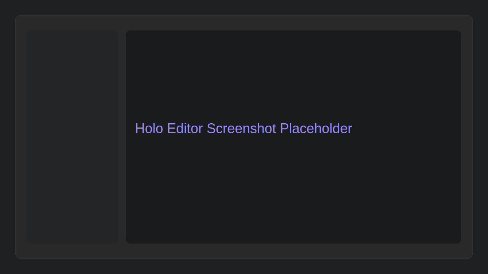
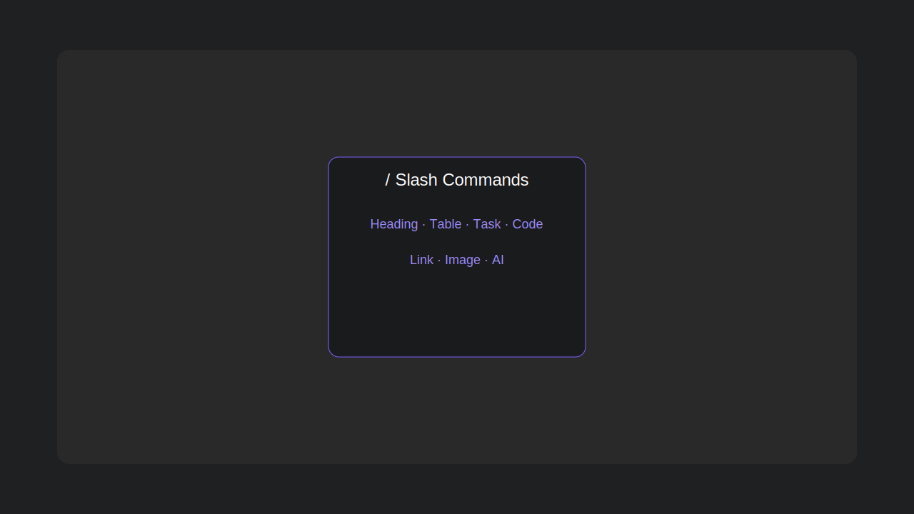
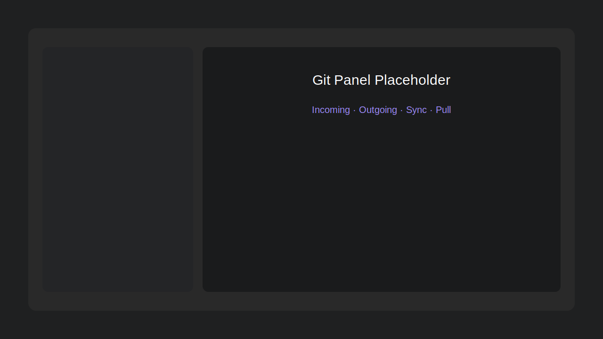

# Holo

Holo is a desktop Markdown editor inspired by modern collaborative editors, built for teams that want a clean writing experience with file-based storage and simple Git sync.

## Why Holo

Holo helps non-technical users edit documentation in Markdown without dealing with terminal commands.

- Edit documents visually (WYSIWYG) or in raw Markdown
- Keep files in your own folders and repositories
- Save and sync with integrated Git actions
- Work with a fast desktop interface (Windows, macOS, Linux)

## Screenshots

Replace these placeholders with real screenshots when ready.

## Main Features

- Markdown file explorer (folders + `.md` files)
- Single-page editing flow focused on clarity
- RAW / WYSIWYG switch
- Slash commands (`/`) for quick blocks (titles, lists, tables, tasks, code, etc.)
- Inline formatting toolbar on text selection
- Editable metadata header (title, description, author, icon, tags)
- Image drag & drop into documents
- Integrated search by content and tags
- Git integration: fetch, pull, commit, merge, sync
- Auto-commit flows for save and file structure changes
- Remote freshness guard (warns/blocks editing when remote is newer until pull)

## Installation

Download the latest release for your OS:

- Windows: `.exe`
- macOS: `.dmg` or `.zip`
- Linux: `.deb`

Then install and launch Holo like any standard desktop app.

## Quick Start

1. Open Holo
2. Open a local folder containing Markdown docs
3. Select a file in the explorer
4. Edit in WYSIWYG or RAW mode
5. Press `Ctrl+S` / `Cmd+S` to save (and auto-sync when configured in Git)

## Typical Workflow

- Create, rename, move, or delete files/folders from the explorer
- Write content with slash commands and formatting shortcuts
- Use the Git panel to fetch/pull/sync when needed
- Resolve conflicts directly from the app when they appear

## Teams/Slack Share Links

To make Holo links clickable in tools like Microsoft Teams, use the HTTPS gateway hosted on Vercel:

- Gateway source is in [holo-link-gateway](holo-link-gateway)
- Deploy this folder as a separate Vercel project (root directory: `holo-link-gateway`)
- In Holo settings, fill **Application → Passerelle lien HTTPS (Teams)** with your deployed URL

When configured, the “Copier le lien” action generates a clickable HTTPS link that redirects to `holo://...`.

## Tech Stack

- Electron
- React + TypeScript
- Vite
- Tailwind CSS

## Project Status

Roadmap and feedback tracking are available in [Process.md](Process.md).
